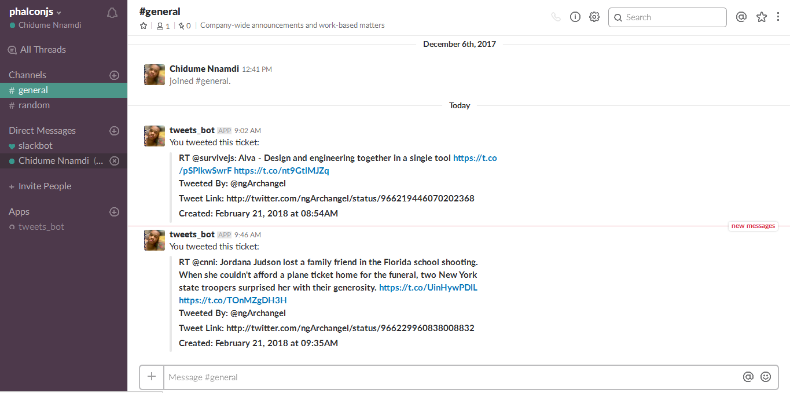

# auth0_webtask_hack
A [IFTTT(if this, then that)](https://ifttt.com)-based [Webtask](https://webtask.io) Slack bot that sends message to the general channel of a Slack group when a user tweets, retweets or replies to a tweet in [Twitter](https://twitter.com). 

## Technologies
1. [Webtask.io](https://webtask.io)
1. [Node.js](https://nodejs.org)
1. [Slack bot](https://my.slack.com/services/new/add)
1. [Twitter](https://twitter.com)
1. [IFTTT](https://ifttt.com)

## App Overview

IFTTT sends `Twitter` triggers[tweets, RT and replies] to ===> `Webtask.io` URL, it sends the payload to ===> `Slack` group channel.

## Usage
1. Create a [Twitter](https://twitter.com) account if you don't have one.
1. Create a [Slack](slack.com) group and add a [Slack bot](https://my.slack.com/services/new/add) to the group.
1. Install the [Webtask.io](webtask.io) CLI utility `wt-cli`, if you dont't have it installed:

        npm i wt-cli -g
        wt init

1. Clone this repo to your machine, by running this command:

        git clone https://github.com/philipszdavido/auth0_webtask_hack

1. Move into the directory from your terminal:

        cd auth0_webtask_hack

1. To deploy alongisde with your Slack bot token, run:

        wt create --secret TOKEN=<YOUR_SLACK_BOT_TOKEN_HERE> webtask.js

1. Create a [IFTTT](ifttt.com) Twitter (tweet, retweet, and replies) trigger and link the webhook to the URL generated from the above command.

## How to create the IFTTT Twitter applet
To create the `IFTTT Twitter` trigger, follow these steps:

1. click on `New Applet` button.
1. on the screen thats show, click on `✚this` of this `if **✚this** then that`.
1. on the `Choose a service` window, click on the `Twitter` button
1. Select `New tweet by you This Trigger fires every time you post a new tweet.` on the `Choose trigger` window that shows up.
1. Now on the `Complete trigger fields` window, check the `retweets` and `@replies` so that you can also get the trigger when you RT or replies to a tweet. click on `Create trigger` button when you are done.
1. click on `✚that` of `if then ✚that`.
1. Select `Webhooks` on the `Choose action service` window. You can type `Webh` in the search text to fasten the process.
1. click on `Make a web request This action will make a web request to a publicly accessible URL. NOTE: Requests may be rate limited.` on the next `Choose action` window tha shows up.
1. On the `Complete action fields` window, fill in the form with these value:

        * URL:https://wt-dbafebf712fa816299231d2763fd292e-0.run.webtask.io/auth0_webtask.io_hack?text={{Text}}&username={{UserName}}&tweet_link={{LinkToTweet}}&created={{CreatedAt}}&tweet={{TweetEmbedCode}}
        * Method: GET 

1. click on `create action` button after filling in the fields.
1. Click on the `Finish` button on the next `Review and finish window`.
1. Hooray!! We now have an `ITFFF Twitter tweet, RT and repiles` trigger up and running.
1. Post a tweet to test.

## IFTTT Twitter/Slack webtask bot in action

### Contribute
1. Fork this repository
2. Clone it to your local machine
3. Create a branch for the feature you want to implement
4. Push your changes to your repository
5. Submit a pull request

- Issue Tracker: https://github.com/philipszdavido/auth0_webtask_hack/issues
- Source Code: https://github.com/philipszdavido/auth0_webtask_hack

### Support
If you are having issues, please let me know.
Mail me at: kurtwanger40@gmail.com
